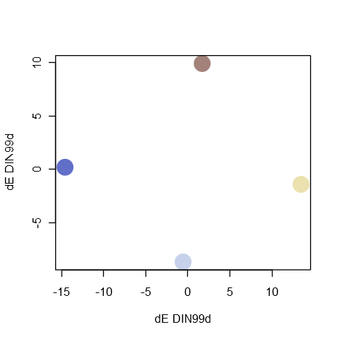
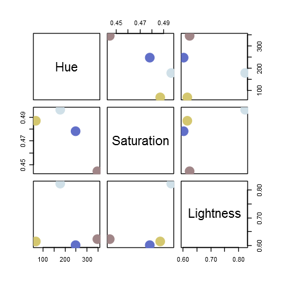

<!-- README.md is generated from README.Rmd. Please edit that file -->

# qualpalr

[](https://travis-ci.org/jolars/qualpalr)
[](https://ci.appveyor.com/project/jolars/qualpalr)
[](https://codecov.io/github/jolars/qualpalr?branch=master)
[](https://cran.r-project.org/package=qualpalr)

`qualpalr` generates distinct qualitative color palettes, primarily for
use in R graphics. Given `n` (the number of colors to generate), along
with a subset in the [hsl color
space](https://en.wikipedia.org/wiki/HSL_and_HSV) (a cylindrical
representation of the RGB color space) `qualpalr` attempts to find the
`n` colors in the provided color subspace that *maximize the smallest
pairwise color difference*. This is done by projecting the color subset
from the HSL color space to the DIN99d space. DIN99d is (approximately)
perceptually uniform, that is, the euclidean distance between two colors
in the space is proportional to their perceived difference.

`qualpalr` was inspired by [i want
hue](http://tools.medialab.sciences-po.fr/iwanthue/).

## Usage

Let’s create a palette of 4 colors of hues from 0 to 360, saturation
between 0.1 and 0.5, and lightness from 0.6 to 0.85.

``` r
library(qualpalr)

pal <- qualpal(n = 4, list(h = c(0, 360), s = c(0.1, 0.5), l = c(0.6, 0.85)))
```

We can retrieve the generated colors in hex format

``` r
pal$hex
#> [1] "#74C970" "#766AC9" "#C86D6A" "#DCCFE0"
```

Altneratively, we can create a palette using one of the predefined color
subspaces and, optionally, adapt it to color deficiency (here
*deuteranomaly*).

``` r
pal2 <- qualpal(n = 4, colorspace = "pretty", cvd = "deutan",
                cvd_severity = 0.5)
```

We can look at a distance matrix of the pairwise color differences from
the palette we have generated.

``` r
pal2$de_DIN99d
#>          #D4C76F  #616FC8  #D0E0E8
#> #616FC8 29.14409                  
#> #D0E0E8 18.78602 21.76547         
#> #A08587 18.59491 18.38472 18.34490
```

The palette may also be plotted with in a multidimensional scaling plot
generated from the distance matrix of the colors in the palette.

``` r
plot(pal2)
```

<!-- -->

Or it might be plotted in one of the provided color spaces as a
scatterplot matrix.

``` r
pairs(pal2, colorspace = "HSL")
```

<!-- -->

## Installation

The current CRAN release can be installed by running

``` r
install.packages("qualpalr")
```

The development version can be installed by running

``` r
devtools::install_github("jolars/qualpalr")
```

## Versioning

Versioning is based on [semantic versioning](http://semver.org/).

## Code of conduct

Please note that this project is released with a [Contributor Code of
Conduct](CONDUCT.md). By participating in this project you agree to
abide by its terms.

## License

`qualpalr` is open source software, licensed under [GPL-3](LICENSE).
