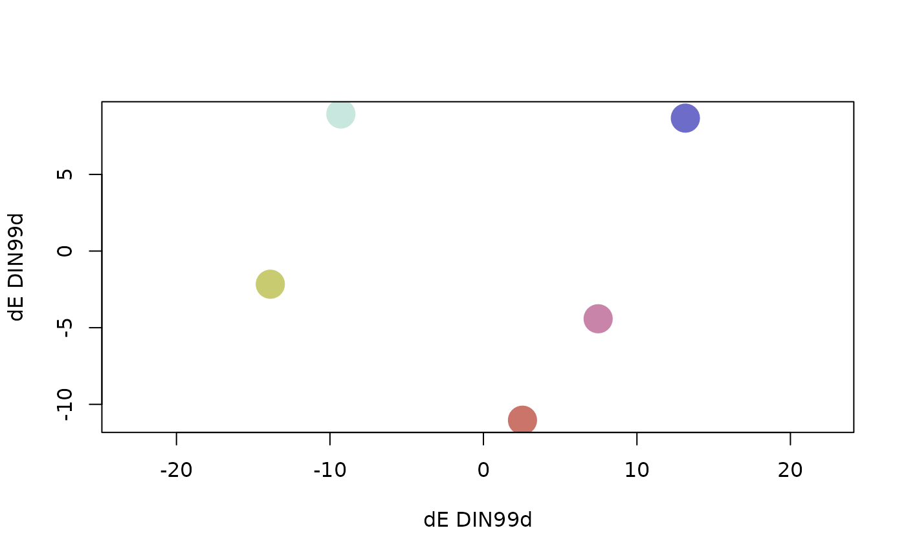
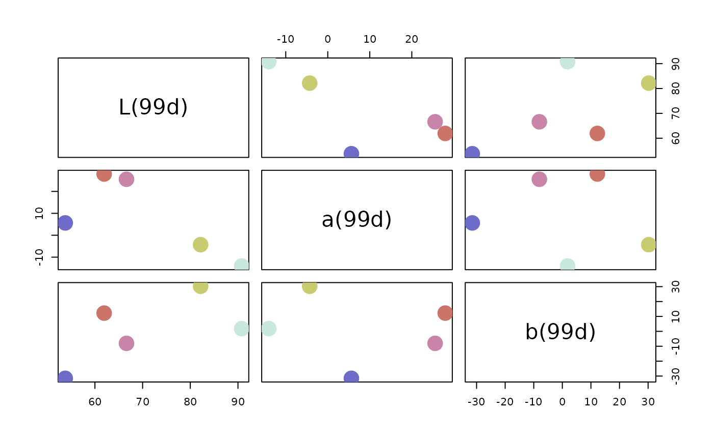
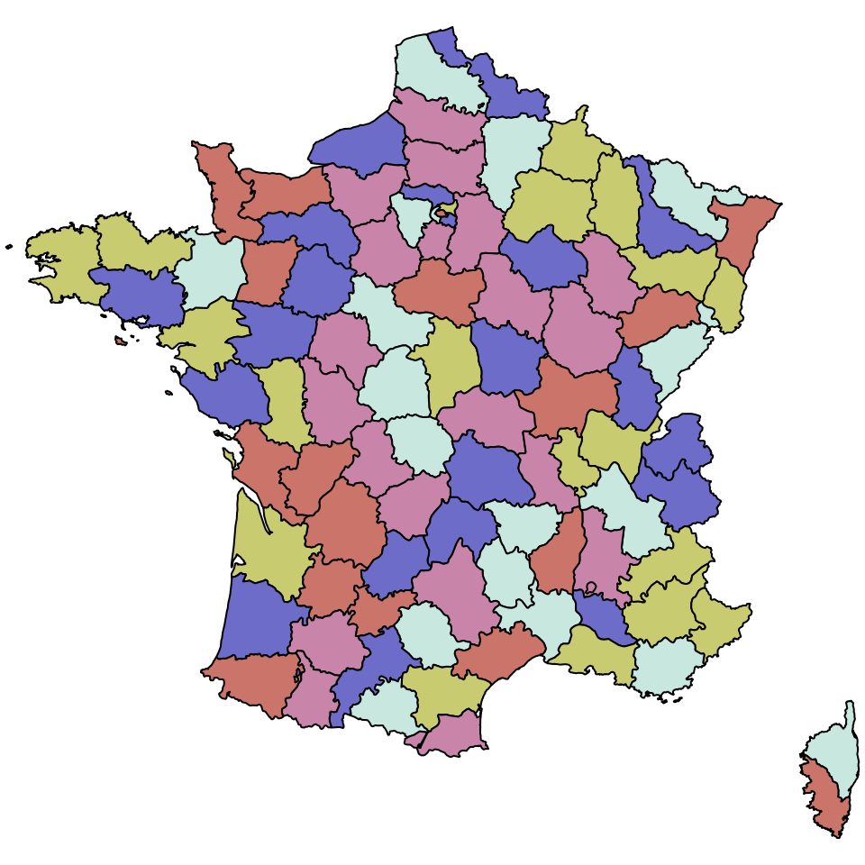

# An introduction to qualpalr

## Overview

`qualpalr` generates qualitative color palettes optimized for maximally
distinct colors. Given `n` (the number of colors to generate), along
with a subset in the [hsl color
space](https://en.wikipedia.org/wiki/HSL_and_HSV)[¹](#fn1) (a
cylindrical representation of the RGB color space) `qualpalr` attempts
to find the `n` colors in the provided color subspace that *maximize the
smallest pairwise color difference*. This is done by computing the
pairwise color differences between all the input colors, and then
selecting the `n` colors that maximize the minimum pairwise color
difference.

## Examples

`qualpalr` main workhorse is
[`qualpal()`](https://jolars.github.io/qualpalr/dev/reference/qualpal.md),
which takes as its input `n` (the number of colors to generate) and
`colorspace`, which can be either

- a list of numeric vectors `h` (hue from -360 to 360), `s` (saturation
  from 0 to 1), and `l` (lightness from 0 to 1), all of length 2,
  specifying a min and max,
- a list of numeric vectors `h` (hue from -360 to 360), `c` (chroma from
  0 to 100), and `l` (lightness from 0 to 100), all of length 2,
  specifying a min and max, or
- a character vector specifying a predefined color palette.

``` r
library(qualpalr)
pal <- qualpal(5, list(h = c(-200, 120), s = c(0.3, 0.8), l = c(0.4, 0.9)))

# Adapt the color space to deuteranopia of severity 0.7
pal <- qualpal(5, cvd = c(deutan = 0.7))
```

The resulting object, `pal`, is a list with several color tables and a
distance matrix based based on the color difference metric used, by
default CIEDE2000 (`metric = ciede2000`).

``` r
pal
```

    ## ---------------------------------------- 
    ## Colors in the HSL color space 
    ## 
    ##      [,1] [,2] [,3]
    ## [1,]  355 0.47 0.61
    ## [2,]  241 0.47 0.61
    ## [3,]  277 0.43 0.75
    ## [4,]  155 0.46 0.85
    ## [5,]   62 0.47 0.62
    ## 
    ##  ---------------------------------------- 
    ## DIN99d color difference distance matrix 
    ## 
    ##    1  2  3  4
    ## 2 22         
    ## 3 17 14      
    ## 4 25 25 20   
    ## 5 22 29 24 16

Methods for `pairs` and `plot` have been written for `qualpal` objects
to help visualize the results.

``` r
# Multidimensional scaling plot
plot(pal)

# Pairs plot in the DIN99d color space
pairs(pal, colorspace = "DIN99d")
```



The colors are most easily used in R by accessing `pal$hex`

``` r
library(maps)
map("france", fill = TRUE, col = pal$hex, mar = c(0, 0, 0, 0))
```



## Details

`qualpal` begins by generating a point cloud out of the HSL color
subspace provided by the user, using a quasi-random Halton sequence.
Here is the color subspace in HSL with settings
`h = c(-200, 120), s = c(0.3, 0.8), l = c(0.4, 0.9)`.

The program then proceeds by projecting these colors into the sRGB
space.

It then continues projecting the colors into the XYZ space. After this,
behavior depends on the metric used. By default, qualpal uses the
CIEDE2000 color difference formula (Sharma, Wu, and Dalal 2005), which
is the current state of the art in color difference metrics and standard
as defined by the International Commission on Illumination (CIE). For
illustrative purposes, however, we will show the procedure when the
DIN99d color space (Cui et al. 2002) is used instead, which is a
perceptually uniform color space that uses the Euclidean distance as a
color difference metric. This makes for a computationally simpler and
faster algorithm, but it is not as accurate as CIEDE2000.

When using the DIN99d color space, we also apply a power transformation
(Huang et al. 2015) to fine tune these differences.

To select the `n` colors that the user wanted, we proceed greedily:
first, we find the two most distant points, then we find the third point
that maximizes the minimum distance to the previously selected points.
This is repeated until `n` points are selected. These points are then
returned to the user; below is an example using `n = 5`.

## Thanks

[Bruce Lindbloom’s webpage](http://www.brucelindbloom.com/) has been
instrumental in making qualpalr. Thanks also to [i want
hue](https://medialab.github.io/iwanthue/), which inspired me to make
qualpalr.

## References

Cui, G., M. R. Luo, B. Rigg, G. Roesler, and K. Witt. 2002. “Uniform
Colour Spaces Based on the DIN99 Colour-Difference Formula.” *Color
Research & Application* 27 (4): 282–90.
<https://doi.org/10.1002/col.10066>.

Huang, Min, Guihua Cui, Manuel Melgosa, Manuel Sánchez-Marañón, Changjun
Li, M. Ronnier Luo, and Haoxue Liu. 2015. “Power Functions Improving the
Performance of Color-Difference Formulas.” *Optics Express* 23 (1): 597.
<https://doi.org/10.1364/OE.23.000597>.

Sharma, Gaurav, Wencheng Wu, and Edul N. Dalal. 2005. “The CIEDE2000
Color-Difference Formula: Implementation Notes, Supplementary Test Data,
and Mathematical Observations.” *Color Research & Application* 30 (1):
21–30. <https://doi.org/10.1002/col.20070>.

------------------------------------------------------------------------

1.  Input can also be a predefined set of colors or a subspace of the
    LCH_(ab) color space.
